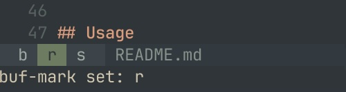
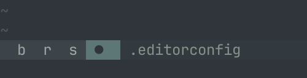

# buf-mark

A Neovim plugin that provides vim-like marks for buffers, allowing you to quickly jump between buffers while preserving cursor positions.

## Problem

When working with multiple files in Neovim, there are typically two main approaches to switch between buffers:

1. **Sequential navigation**: Using `:bnext`, `:bprev`, and `:b#` to cycle through buffers
2. **Fuzzy finding**: Using tools like Telescope or fzf to search and select files

Both approaches have limitations:
- Sequential navigation becomes tedious when you have many buffers open - you end up spamming `:bprev` and `:bnext` to find the file you want
- Fuzzy finders require you to type out enough of the filename to narrow the results down

## Solution
Unlike vim's traditional marks which remember positions within a file, buffer marks remember entire buffers. When
you jump to a buffer mark the cursor position is automatically restored to where you last left it.


### Features
- **Buffer Marks**: Set marks to buffers using single characters (similar to vim's global marks)
- **Cursor Position Preservation**: Automatically saves and restores cursor position when leaving and entering marked buffers
- **Mark Persistence**: Optionally persist marks across Neovim sessions, saved per working directory
- **Simple API**: Easy-to-use functions for setting, deleting, and jumping to buffer marks
- **Customizable Keymaps**: Default keymaps provided, but can be disabled for custom configuration

### Differences from Native Vim Marks

| Feature | native marks | buf-marks |
|---------|------------------|----------|
| **Scope** | Position within a single file | Entire buffer/file |
| **Navigation** | Jump to specific line/column | Jump to buffer + restore cursor position |
| **Persistence** | Lost when buffer is deleted | Optionally persists across sessions |
| **Use Case** | Bookmarking locations within files | Quick buffer switching |

### Do I need this plugin?

Native Vim marks can actually be used to achieve similar buffer-switching behavior. For a simple,
lightweight alternative that doesn't require a plugin, see [Using Native Marks](docs/using_native_marks.md).

This plugin provides additional features like mark persistence across sessions and status line integrations,
but the native marks approach may be sufficient for many workflows.

## Usage

### Default Keymaps

The default keymaps mirror native marks but are prefixed with `<leader>`:

| keymap | function |
|--------|----------|
| `<leader>m{char}` | Set buffer mark `{char}` for the current buffer |
| `<leader>'{char}` | Jump to buffer mark `{char}` |
| `<leader>'<Tab>`  | Jump to the alternate buffer |
| `<leader>'?`      | List buffer marks |
| `<leader>M{char}` | Delete buffer mark `{char}` |

### Example Workflow

1. Open a file (e.g., `config.lua`)
2. Press `<leader>mc` to mark this buffer with character `c`
3. Navigate to another file
4. Press `<leader>'c` to instantly jump back to `config.lua` at the exact cursor position you left

## Installation

### [lazy.nvim](https://github.com/folke/lazy.nvim)

```lua
{
  "ryanburda/buf-mark",
  config = function()
    require("buf-mark").setup()
  end,
}
```

### [packer.nvim](https://github.com/wbthomason/packer.nvim)

```lua
use {
  "ryanburda/buf-mark",
  config = function()
    require("buf-mark").setup()
  end,
}
```

## Configuration

### Setup Options

```lua
require("buf-mark").setup({
  -- Set to true to enable default keymaps
  keymaps = true,
  -- Set to true to persist marks between Neovim sessions.
  -- Marks will be saved per working directory
  -- (e.g., marks in ~/project-a are separate from ~/project-b)
  persist = true,
  -- Customize status highlight groups
  status = {
    hl_current = 'StatusLine',       -- Highlight group for current buffer's mark
    hl_non_current = 'StatusLineNC', -- Highlight group for non-current buffers' marks
  }
})
```

#### Status Highlight Groups

By default, the status module uses `StatusLine` for the current buffer's mark and `StatusLineNC` for marks of non-current buffers. You can customize these highlight groups to match your colorscheme or statusline configuration:

```lua
require("buf-mark").setup({
  status = {
    hl_current = 'TabLineSel',      -- Use TabLineSel for current buffer's mark
    hl_non_current = 'TabLine',     -- Use TabLine for non-current buffers' marks
  }
})
```

For an alternative keymap configuration that repurposes native local mark keybindings for
buf-marks, see [Author's Keymap Preferences](docs/authors_keymaps.md).

## Commands

### `:BufMarkList`

Lists all buffer marks with their associated files. The output displays:
- Mark character
- File path (relative to current directory)

Example output:
```
mark  file
 a    src/config.lua
 b    README.md
 c    /path/to/file.txt
```

### `:BufMarkSet <char>`

Set a buffer mark for the current buffer using the specified character.

**Example:**
```
:BufMarkSet a
```

### `:BufMarkDelete <char>`

Delete the buffer mark for the specified character.

**Example:**
```
:BufMarkDelete a
```

### `:BufMarkGoto <char>`

Jump to the buffer associated with the specified mark character.

**Example:**
```
:BufMarkGoto a
```

### `:BufMarkDeleteAll`

Delete all buffer marks for the current project. This will clear all marks in the current working directory if buffer marks are being persisted.

**Example:**
```
:BufMarkDeleteAll
```

## API

### `setup(opts)`

Initialize the plugin with optional configuration.

**Parameters:**
- `opts` (table, optional): Configuration options
  - `keymaps` (boolean): Enable/disable default keymaps (default: `true`)
  - `persist` (boolean): Enable mark persistence between sessions, saved per working directory (default: `true`)
  - `status` (table, optional): Status module configuration
    - `hl_current` (string): Highlight group for current buffer's mark (default: `'StatusLine'`)
    - `hl_non_current` (string): Highlight group for non-current buffers' marks (default: `'StatusLineNC'`)

**Example:**
```lua
require("buf-mark").setup({
  keymaps = true,
  persist = true,
  status = {
    hl_current = 'TabLineSel',
    hl_non_current = 'TabLine',
  }
})
```

### `list()`

Returns all buffer marks as a table mapping characters to file paths.

**Returns:**
- `table`: A table where keys are mark characters and values are file paths

**Example:**
```lua
local marks = require("buf-mark").list()
for char, path in pairs(marks) do
  print("Mark " .. char .. " -> " .. path)
end
```

### `list_pretty()`

Display all buffer marks with their associated buffer information in a formatted view.

**Example:**
```lua
require("buf-mark").list_pretty()
```

### `set(char)`

Set a buffer mark for the current buffer.

**Parameters:**
- `char` (string): A single character to use as the mark identifier

**Example:**
```lua
require("buf-mark").set('a')
```

### `delete(char)`

Delete a buffer mark.

**Parameters:**
- `char` (string): The mark character to delete

**Example:**
```lua
require("buf-mark").delete('a')
```

### `goto(char)`

Jump to the buffer associated with the given mark.

**Parameters:**
- `char` (string): The mark character to jump to

**Example:**
```lua
require("buf-mark").goto('a')
```

### `delete_all()`

Delete all buffer marks for the current project.

**Example:**
```lua
require("buf-mark").delete_all()
```

## Events

### `BufMarkChanged`

A custom User autocommand event that fires whenever the set of buffer marks changes. This event is triggered after marks are set, deleted, or cleared.

**Use cases:**
- Update a statusline component showing current marks
- Display notifications when marks change
- Implement custom mark visualization similar to [Status](#status) shown below

## Status

### `buf-mark.status`

The `buf-mark.status` module provides a function to display buf-marks **for currently open buffers**.
This is useful for integrating buf-mark information into statuslines, tablines, or other UI components.

**Why only show marks for open buffers?**

Over time, you'll accumulate marks for many buffers across your project. Displaying all marks would create
visual clutter and make it harder to find the information you need. By showing only marks for currently open
buffers, the status display provides focus and context for the specific problem you're working on right now.
If you need to see all marks, you can list them separately using `:BufMarkList`.

**Features:**
- Shows marks in alphabetical order, highlighting the current buffers mark

  

  

- Indicates if the current buffer doesn't have a mark

  

#### Usage with statusline

```lua
vim.o.statusline = '% %f %m'
```

#### Usage with lualine

```lua
require('lualine').setup({
  sections = {
    lualine_a = {require('buf-mark.status').get},
  }
})
```

## License

MIT

## Contributing

Contributions are welcome! Please feel free to submit a Pull Request.
